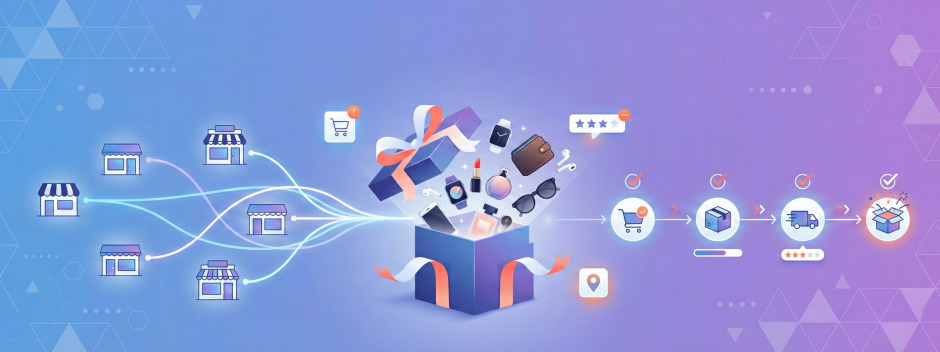

# 🎁 Giftora

## One gift. Many vendors. One seamless experience.

Giftora is a centralized multi-vendor marketplace where customers combine products from different independent vendors into one personalized gift box. Giftora coordinates payment, vendor fulfilment, quality assurance, professional packing, and delivery tracking as one order.



[](https://github.com/cepdnaclk/e23-co2060-GiftBox-Customization-Marketplace/tree/main/code/frontend)
[](https://github.com/cepdnaclk/e23-co2060-GiftBox-Customization-Marketplace/tree/main/code/backend/nexus)


## Project at a glance

| | |
|---|---|
| **Project** | Giftora — Personalized Gift Box Marketplace |
| **Team** | Nexus · E23 GR33 |
| **Module** | CO2060 — Software Systems Design Project |
| **Department** | Computer Engineering, University of Peradeniya |
| **Core idea** | A single gift box assembled from products supplied by multiple vendors |
| **Users** | Customer, Vendor, Assembler, Administrator |

## The problem

Online gifting becomes difficult when a customer wants products from several sellers. They must place and pay for separate orders, coordinate different delivery times, accept inconsistent wrapping, and track multiple parcels. Traditional catalogues also limit personalization to fixed bundles.

## Our solution

Giftora connects every participant through one end-to-end workflow:

1. **Discover** — browse a unified catalogue from approved vendors.
2. **Customize** — select a ready-made gift or build a box item by item.
3. **Checkout once** — place one order and complete one payment flow.
4. **Split automatically** — create vendor-specific sub-orders behind the scenes.
5. **Fulfil** — vendors prepare their assigned products for the assembly hub.
6. **Verify and pack** — an assembler checks every item, records issues, and packs the final box.
7. **Track** — follow the complete gift through a single milestone timeline.

```text
Customer order
      │
      ├── Vendor A sub-order ──┐
      ├── Vendor B sub-order ──┼──► Assembly hub ──► QA ──► Packed gift ──► Customer
      └── Vendor C sub-order ──┘
```

## What we built

### Customer application

- Public landing page, catalogue, categories, and featured products
- Registration, email verification, login, JWT session, and account settings
- Interactive gift-box builder with live totals
- Persistent shopping cart and delivery-address management
- Standard or custom-box checkout with Stripe payment intents
- Order history and detailed milestone tracking

### Vendor application

- Vendor onboarding and administrator approval
- Dashboard with product, stock, and order information
- Product CRUD, activation status, SKU and inventory management
- Cloudinary-backed product image upload
- Vendor-specific sub-orders and fulfilment status updates
- Ready-made gift-box creation

### Assembly application

- Protected incoming-order queue
- Order workspace with item verification
- Missing/damaged-item issue tracking
- Assembly, quality-assurance, packing, and completion stages
- Packing guide, completed-order view, and monthly operational metrics

### Administrator application

- Operational overview dashboard
- Vendor approval and account-status controls
- Customer and category management
- Assembler staff creation, activation, and performance information

## System architecture

```text
┌──────────────────────────────────────────────────────────────┐
│ React 19 frontend                                            │
│ Public · Customer · Vendor · Assembler · Administrator       │
└──────────────────────────────┬───────────────────────────────┘
                               │ HTTPS / REST / JSON / JWT
┌──────────────────────────────▼───────────────────────────────┐
│ Spring Boot 4 backend                                        │
│ Security · Catalogue · Cart · Orders · Payment · Assembly    │
└──────────────────────────────┬───────────────────────────────┘
                               │ JPA / Flyway
┌──────────────────────────────▼───────────────────────────────┐
│ MySQL 8 database                                             │
│ Products · Users · Carts · Orders · Sub-orders · QA state    │
└──────────────────────────────────────────────────────────────┘
```

### Deployment design

- **Frontend:** React build designed for Vercel
- **Backend:** Spring Boot service deployed through GitHub Actions to Azure App Service
- **Database:** managed MySQL on Aiven with encrypted connectivity
- **Media:** Cloudinary product-image storage
- **Automation:** repository-to-deployment-branch synchronization and backend CI/CD workflows

## Technology stack

| Layer | Technology |
|---|---|
| User interface | React 19.2, React Router 7, Recharts, CSS |
| API | Spring Boot 4.0.2, Java 17, Maven |
| Persistence | Spring Data JPA, MySQL 8+, Flyway migrations V1–V24 |
| Security | Spring Security, JWT access/refresh flow, BCrypt, role-based access control |
| Payments and media | Stripe, Cloudinary |
| Testing | Jest, React Testing Library, JUnit, Spring integration tests, H2, optional MySQL tests |
| Hosting and delivery | Vercel, Azure App Service, Aiven, GitHub Actions |

## Key design decisions

- **Parent orders and sub-orders** preserve one customer checkout while giving each vendor an isolated fulfilment queue.
- **Role-based portals** provide focused workflows and enforce Customer, Vendor, Assembler, and Administrator permissions in both the API and UI.
- **Persistent custom-box carts** allow gift configurations to survive navigation and authenticated sessions.
- **Migration-driven schema evolution** keeps the database reproducible as commerce and assembly workflows change.
- **Dedicated assembly state** records verification, issues, packing, and QA without overloading the customer order model.

### Database ownership

The versioned Flyway scripts under `code/backend/nexus/src/main/resources/db/migration` are the only source of truth for database schema and seed changes. The project does not require a separate manual SQL import step; the backend migration configuration manages the core, commerce, and assembly migration streams.

## Current implementation status

- ✅ Authentication, email verification, refresh tokens, and role-based access
- ✅ Product catalogue, categories, vendor inventory, and media uploads
- ✅ Custom gift-box builder and persistent cart
- ✅ Standard and customized order creation
- ✅ Multi-vendor parent-order and sub-order model
- ✅ Stripe payment-intent integration
- ✅ Customer order history and status timeline
- ✅ Vendor fulfilment portal
- ✅ Assembler queue, order workspace, issue handling, packing, and QA
- ✅ Administrator dashboard and user/vendor/staff management
- ✅ Flyway schema evolution through V24
- ✅ Frontend unit/component tests and backend unit/integration suites

## Testing strategy

| Level | Coverage |
|---|---|
| Unit | Authentication utilities, business rules, payload builders, status logic, and API adapters |
| Component | Customer cart state and assembler order-workspace behaviour |
| Integration | Secured marketplace workflow across controllers, services, repositories, and H2 |
| Database | Optional MySQL migration and assembly-workflow verification |
| Manual system testing | Complete Customer → Vendor → Assembler → Customer journeys |

## Engineering challenges addressed

- Modelled one customer purchase as multiple independently fulfilled vendor sub-orders.
- Introduced versioned products and migration backfills to protect order consistency.
- Separated persistent cart, commerce, and assembly state while retaining a unified user experience.
- Applied DTO/fetch-boundary improvements to avoid lazy-loading failures in API responses.
- Configured cross-origin communication between separately hosted frontend and backend services.
- Moved runtime secrets and deployment configuration to environment-controlled settings.

## Next steps

- Complete end-to-end regression coverage for all four role workflows.
- Replace remaining prototype catalogue fallbacks with API-only data.
- Expand delivery-provider integration and customer notifications.
- Add production observability, accessibility checks, and performance monitoring.
- Conduct user-acceptance testing and refine the box-building experience from feedback.

## Team Nexus

| Student ID | Name | Primary contribution area | Email |
|---|---|---|---|
| **E/23/167** | Karunarathna A. V. P. J. P. | Vendor frontend and customer portal UI/UX | [e23167@eng.pdn.ac.lk](mailto:e23167@eng.pdn.ac.lk) |
| **E/23/351** | Sanjuna K. D. | Administration, backend, and database implementation | [e23351@eng.pdn.ac.lk](mailto:e23351@eng.pdn.ac.lk) |
| **E/23/412** | Vidanya A. P. S. | Public landing and customer-page UI/UX | [e23412@eng.pdn.ac.lk](mailto:e23412@eng.pdn.ac.lk) |
| **E/23/416** | Vishwaka A. G. S. | Authentication, vendor UI/UX, and database support | [e23416@eng.pdn.ac.lk](mailto:e23416@eng.pdn.ac.lk) |

## Links

- [GitHub repository](https://github.com/cepdnaclk/e23-co2060-GiftBox-Customization-Marketplace){:target="_blank"}
- [Giftora project page](https://cepdnaclk.github.io/e23-co2060-GiftBox-Customization-Marketplace/){:target="_blank"}
- [Department of Computer Engineering](https://www.ce.pdn.ac.lk/){:target="_blank"}
- [Faculty of Engineering, University of Peradeniya](https://eng.pdn.ac.lk/){:target="_blank"}
